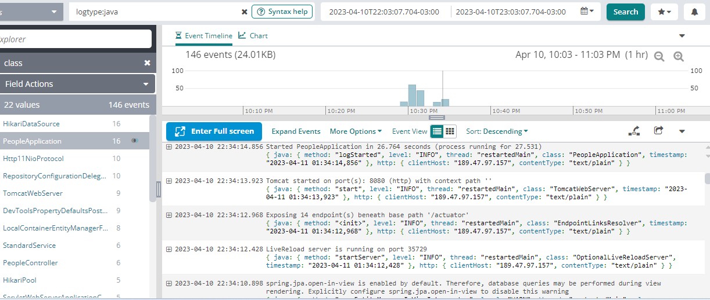
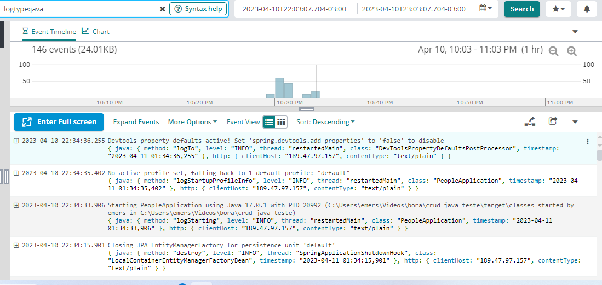

# API de Pessoas
Essa API permite a criação, atualização, exclusão e busca de pessoas em um sistema.

### Como executar a aplicação
Para executar a aplicação, você precisa ter o JDK 11 ou superior e o Maven instalados. Depois de clonar o repositório, navegue até a raiz do projeto e execute o seguinte comando:

```
mvn spring-boot:run
```
Caso tenha problemas em baixar alguma dependencia tente executar os seguintes comandos:

```
mvn dependency:purge-local-repository
```
e

```
mvn clean install
```

e 

```
mvn clean package
```

A aplicação estará disponível em http://localhost:8080.

### Como compilar a aplicação

Esse comando irá gerar um arquivo jar na pasta target.

### Como executar os testes
Para executar os testes da aplicação, navegue até a raiz do projeto e execute o seguinte comando:
```
mvn test
```
### Informações do Actuator
O Actuator é uma ferramenta do Spring Boot que permite a monitoração e administração da aplicação. Essa API está configurada para utilizar o Actuator.

Você pode acessar as informações do Actuator na seguinte URL: http://localhost:8080/actuator.

Algumas das informações disponíveis são:

* **`/actuator/health`**: verifica o estado da aplicação;
* **`/actuator/prometheus`**: informações da métricas do projeto com Prometheus utilizando o micrometer;
* **`/actuator/metrics`**: informações de métricas da aplicação;

### Logs da aplicação

Os logs foram exportados para a Loggly usando o log4j:

imagem 1:



imagem 2:



Localmente tabem é possivel ver os logs em tempo de execução:

