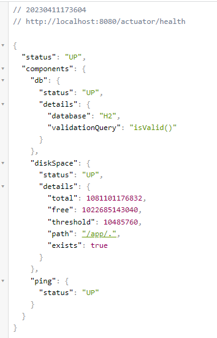

# API de Pessoas
Essa API permite a criação, atualização, exclusão e busca de pessoas em um sistema.

### Instruções para executar o projeto com docker:

Rodar os comandos:

Esse comando irá gerar um arquivo jar na pasta target:
```
mvn clean package
```
realiza o build da aplicação:
```
docker build -t people
```
Caso queira rodar somente a API execute o comando abaixo:
```
docker run -p 8080:8080 people
```
Para subir todos os containers da aplicação:
```
docker-compose up
```
### Links da aplicação:
URL da API: http://localhost:8080/people/getAll <BR>
URL do Zipkin: http://localhost:9411 <BR>
URL do Prometheus: http://localhost:9090 <BR>

### EndPoints:

| Método | Rota           | Requisição                      |
|--------|----------------|---------------------------------|
| DELETE | /people/{CPF}  | Deleta uma pessoa por ID/CPF    |
| GET    | /people/{CPF}  | Busca por ID/CPF                |
| POST   | /people        | Busca todos os cadastrado na DB |
| PUT    | /people/{CPF}  | Atualiza um clinete no DB       |


# A pipeline de build está sendo realizada pelo Github Actions.

### Como executar a aplicação sem docker
Para executar a aplicação, você precisa ter o JDK 11 ou superior e o Maven instalados. Depois de clonar o repositório, navegue até a raiz do projeto e execute o seguinte comando:

```
mvn spring-boot:run
```
Caso tenha problemas em baixar alguma dependencia tente executar os seguintes comandos:

```
mvn dependency:purge-local-repository
```
e

```
mvn clean install
```

A aplicação estará disponível em http://localhost:8080/people/getAll.

### Como compilar a aplicação (execute antes de subir a aplicação com docker)

Esse comando irá gerar um arquivo jar na pasta target.

```
mvn clean package
```

### Como executar os testes
Para executar os testes da aplicação, navegue até a raiz do projeto e execute o seguinte comando:
```
mvn test
```
### Informações do Actuator
O Actuator é uma ferramenta do Spring Boot que permite a monitoração e administração da aplicação. Essa API está configurada para utilizar o Actuator.

Você pode acessar as informações do Actuator na seguinte URL: http://localhost:8080/actuator.

Algumas das informações disponíveis são:

* **`/actuator/health`**: verifica o estado da aplicação;



### Metricas do projeto no formato Prometheus utilizando o micrometer

URL: http://localhost:9090/ (Dashboard do prometheus)
* **`/actuator/prometheus`**: rota das métricas


### Logs da aplicação

Os logs foram exportados para a Loggly usando o log4j:

imagem 1:


imagem 2:


Localmente tabem é possivel ver os logs em tempo de execução:

